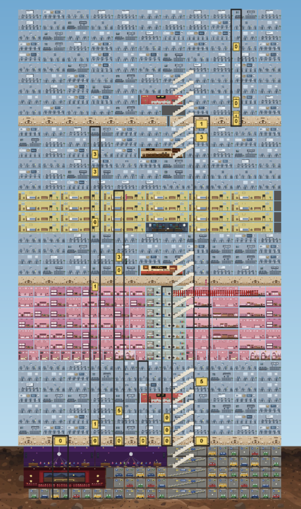
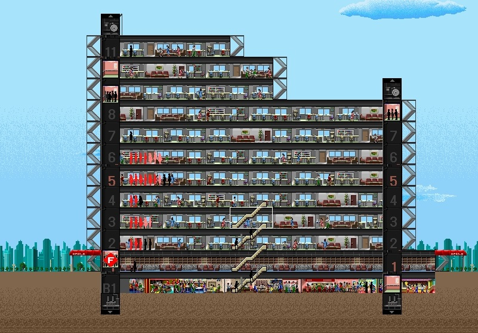

# Reverse Engineering SimTower

I woke up the other day and asked: could an LLM reverse engineer a modern clone of my favorite childhood video game? So I did it. [towers.world]() is live today and allows collaborative, coop play on a perfect clone of the original game.

### The Clone

### The Original

*Thanks to [this retrospective](https://sonatano1.wordpress.com/2014/07/19/retrospective-simtower/) for the image.*

At its core, the game is an elevator simulator. It starts getting hard when your tower grows and your sims contend with each other on getting where they want to go. For example, offices grow your tower the fastest, but they come with 6 sims on a synchronized 9-5 schedule that heavily loads your elevators. As a result, you have to manage very tightly what floors your elevators go to and when.

Unfortunately, the game is now basically impossible to play without an emulator. You could reimplement it if the engine were fully described somewhere—but it isn't. My original idea was to have the LLMs reverse engineer the binary into a complete spec, and then use that spec to reimplement the game. I was inspired by Simon Willison's [posts](https://simonwillison.net/2025/Dec/15/porting-justhtml/) on translating programs from one language to another—after all, assembly language is a programming language like any other, with well-defined semantics. Then I could add features like collaboration and better UI (primarily a build-a-grid-of-rooms feature).

So I did it. I started with the general binary reverse-engineering framework I've built, [reaper](https://github.com/phulin/reaper). It's a simple harness around a coding agent for static analysis: what can you learn about the binary from reading its disassembled code?

### The Static Analysis Era

`reaper` uses a set of prompt templates and a skill to enable the AI of your choice to connect to Ghidra. Over multiple prompting sessions, the AI builds up understanding of the binary, beginning with low-level, easy-to-identify functions and data structures that compose into the higher-level logic. This process has worked for me on smaller programs, and I was hoping to use the output as the foundation of the clean-room spec.

That was my theory, at least. I had dramatically underestimated the complexity of a full specification. Each room's sims have 10-15 possible states and a complex state transition function requiring. And due to the optimizations necessary at the time, the game aggressively caches and stores any computation it can, often in packed bitfields or other obscure structures. The results? I'd say they approached a functioning simulation. But the simulation never got to a point that was playable, and certainly never got to behavioral parity.

Static analysis did teach me three specific failures of the current AIs.

First, the AI makes premature conclusions about subsystems, records them, and then struggles to figure out when to abandon its earlier guesses. Worse, it struggles with what level of specificity to use. It would frequently choose bizarre abstract terms like "runtime entity" to describe a sim or "queued-car continuation" to describe a sim getting in line at the elevator. In the first pass, it found the multi-floor lobby code and called it the "lower-atrium band," a term I haven't yet been able to fully excise from the Ghidra database and notes (because it's everywhere).

It also gets lazy about recording its conclusions, often neglecting to name parameters and local variables as instructed. My prompts are very clear that it should analyze function-by-function, and make sure every local variable and every parameter is named, but it just doesn't do it. The models have been getting better at this every iteration, but they aren't there yet.

When constructing the spec, it had trouble splitting apart the conceptual design of the simulation from the specific implementation details of the binary. I was looking for a clean-room design spec, not a description of data structure layout—but if I asked it not to include binary details, it would move to a conceptual level that was not detailed enough to reimplement.

Many of these challenges are driven by a lack of tools to manage the context window. Disassembly and decompiler output are just too verbose for an LLM starting from scratch. While I do think there are ways to handle this by making the exploration more LLM-native, using a single Ghidra database is a difficult environment for the LLM to work in. Over and over, I watched the LLM compact and compact, forgetting the details of what it just explored. Unlike text-processing tasks, to reverse engineer you need to have all the precise details in working memory. Compacted summaries don't cut it.

Still, I persevered. I spent about a week guiding the LLM to refine the spec, discard its incorrect guesses and build tests for the rewritten simulation. I repeatedly asked it to review and improve the spec, pointed to specific deficiencies that needed to be filled in. But I never got there.
### The Dynamic Analysis Era

So what next? A friend pointed me to [this February post about SimCity](https://garryslist.org/posts/ai-just-ported-simcity-in-4-days-without-reading-the-code), which described engineer Christopher Ehrlich's efforts to compare a function-for-function SimCity port to the original via input/output comparisons. Ehrlich's original tweets in turn cited a user named banteg's [post on the game Crimsonland](https://banteg.xyz/posts/crimsonland/).

I didn't want to do a function-by-function port. First, APIs may be copyrightable - and copying a binary that closely might implicate copyright more than an approach closer to clean-room design. But it was clear that I needed some level of feedback from the ground-truth binary in order to provide a hill for the LLM to climb on the reimplementation.

An immediate problem: the whole justification for this project is that we can't run SimTower on modern hardware. Unlike banteg's project, which used WinDbg, we need some kind of emulator. Off-the-shelf whole-system emulators are not the best option, as you often end up sifting for the program behavior you're interested in through millions of instructions of operating system cruft. A quick search reminded me of the existence of [unicorn](https://unicorn-engine.org), an emulation framework that uses the JIT code-generation logic from QEMU to allow arbitrary emulation pipelines.

I had Claude Code build a Unicorn emulator with a custom mock for each of the 195 Windows 3.1 API functions called by the game. My prompt to Claude was barely more detailed than this sentence. The work took all of about a half an hour and was 99% correct, except for one nasty bug in the loader Claude built that did cause some downstream issues (of course, Claude found the bug later and fixed it). I did almost no work to make this happen. Honestly, I found the resulting success (which took basically zero guidance) to be yet another shocking LLM progress moment.

I then had Claude specify a bunch of small tower configurations, call functions inside the emulated binary to build the rooms, and record snapshots of tower state every few game ticks to enable comparison with the reimplementation. Once I had the state traces, I could direct the AI to autonomously fix any issues that were causing divergence from the emulated binary behavior.

Of course, this meant I needed to make sure every detail matched precisely: most irritatingly, the RNG and the ordering of processing sims each step had to match. RNG parity means that every function that uses the RNG needs to run in the same sequence, or e.g. the wrong sim will be dispatched and lead to a cascading chain of mismatched state. The original binary allocates sims using something like a slab allocator, and some rooms "claim" space in then table and then release it. To get RNG parity, you need to replicate this pattern somewhere so that RNG calls triggered by sim iteration happen in the same order.

From there, it was just repeated improvements to the trace test coverage and letting Claude Code run for hours and hours (my longest run without any prompting was about 8 hours, and it autonomously fixed 5 parity bugs and committed its changes during that time).

## Lessons

As I worked further the game converged on a closer and closer reproduction of the original binary's structure, violating my original not-function-by-function constraint. But I think that's OK. Once we have a perfect reproduction, with comments and named functions and variables in a high-level language, we can use the AI to translate again if we need to.

The cool thing is that emulation and state-matching provide an excellent verification target. The LLM can hill-climb piece by piece as more of the trace matches, and it knows enough about code to autonomously debug and solve issues. The big lesson—one I keep relearning—is that the LLMs need to be in a closed loop when doing complex tasks. They are just not capable (yet) of executing an abstract task like clean-room design from static analysis reliably. Repeating "make it better" does not solve the problem: you need the dynamic-analysis verification on the backend.

There are also a number of specific harness patterns I found helpful. The best way I've found to get current LLMs to operate autonomously is to have a high-level coordination thread that runs for a long time and low-level subagents for specific tasks.

This project used an absolutely ridiculous number of tokens. I had to upgrade to the Claude Code $200/month plan and carefully avoid usage in the 8 AM-2 PM 2x peak window. While autonomous hill-climbing is a great pattern for LLMs, it is not something you can do cheaply. They want to experiment and fill up their context window with information they might need to know from your project. You can very carefully engineer your way around some of this, but lots of unavoidable. There are some interesting approaches for disassembly in the academic literature, e.g. custom formats to reduce the verbosity, but none address the fundamental problem.

In conclusion: I did this, and you can do it too! You can translate code from machine code to a modern language. There are terabytes of abandoned machine code out there. For the first time, we have a tool that lets us economically modify and reuse that software in a sustainable way. That's an incredible advance.

[towers.world](https://towers.world) is available now. Play it!